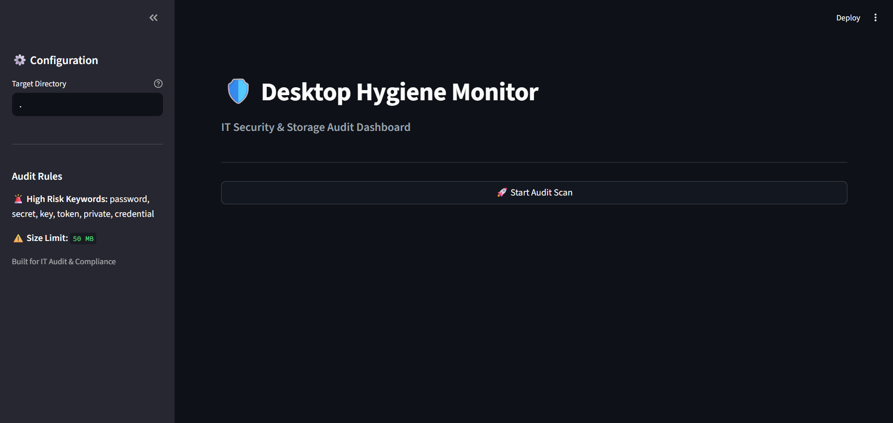

🛡️ Desktop Hygiene Monitor
A Python-based IT Audit dashboard designed to scan local directories for security risks, storage inefficiencies, and documentation gaps.

🚀 Features
Risk Detection: Automatically flags files with sensitive keywords (passwords, keys, secrets).
Storage Analysis: Identifies large files (>50MB) that waste disk space.
Documentation Check: Verifies the presence of README.md for project compliance.
Visual Dashboard: Dark-themed UI with risk distribution charts and detailed reports.
🛠️ Tech Stack
Python 3.x
Streamlit (Web App Framework)
Pandas (Data Analysis)
Matplotlib (Data Visualization)
📦 Installation
Clone the repository.
Create a virtual environment:
python -m venv venvvenv\Scripts\activate  (Windows)source venv/bin/activate (Mac/Linux)
Install dependencies:
bash

pip install -r requirements.txt
Run the app:
bash

streamlit run app.py
📸 Screenshots
